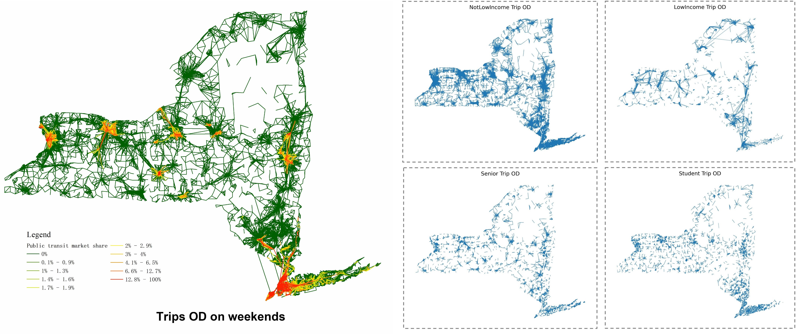
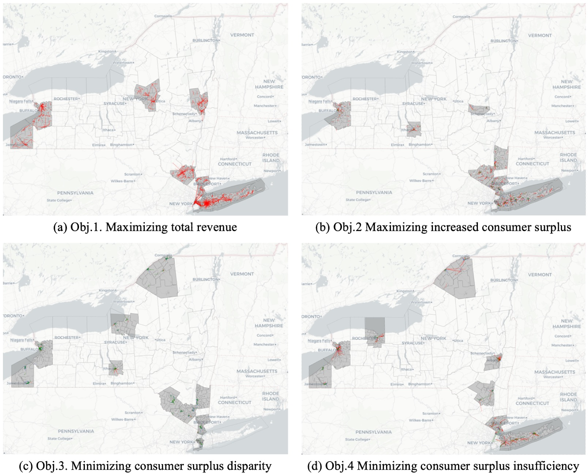

# Discrete Choice Modeling for Travel Behavior Analysis

This repo contains a demo of building multinomial logit (MNL), mixed logit (MXL), and agent-based mixed logit (AMXL) using mobile phone-derived commuting data in Shanghai and synthetic population data in New York State.

#### Reference
Ren, X., & Chow, J. Y. (2022). A random-utility-consistent machine learning method to estimate agents’ joint activity scheduling choice from a ubiquitous data set. Transportation Research Part B: Methodological, 166, 396-418.

Ren, X., Chow, J. Y., Bansal P. (2025). Estimating a k-modal nonparametric mixed logit model with market-level data, Transportation Research Part B: Methodological, accepted. https://arxiv.org/abs/2309.13159

Ren, X., Chow, J. Y., & Guan, C. (2024). Mobility service design with equity-aware choice-based decision-support tool: New York case study. Transportation Research Part D: Transport and Environment, 132, 104255.

