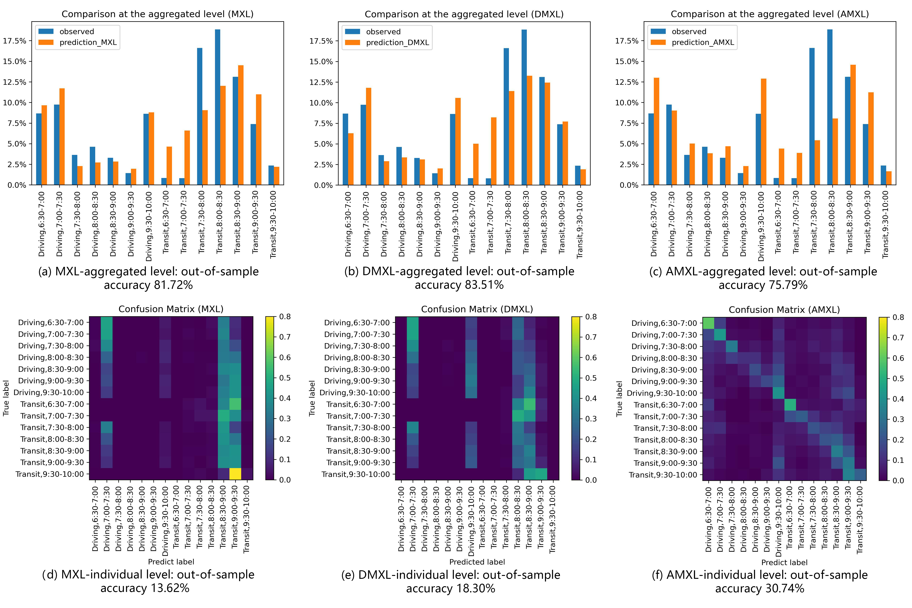

# Discrete Choice Modeling for Travel Behavior Analysis

This repo contains a demo of building multinomial logit (MNL), mixed logit (MXL), and agent-based mixed logit (AMXL) using mobile phone-derived commuting data in Shanghai and synthetic population data in New York State.

#### Reference
Ren, X., & Chow, J. Y. (2022). A random-utility-consistent machine learning method to estimate agents’ joint activity scheduling choice from a ubiquitous data set. Transportation Research Part B: Methodological, 166, 396-418.

